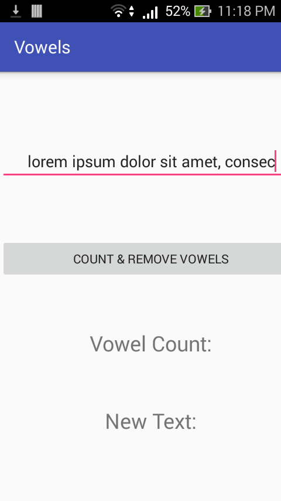
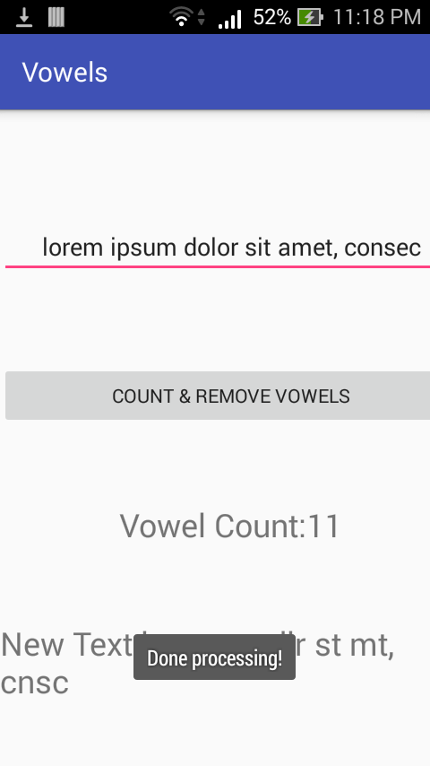
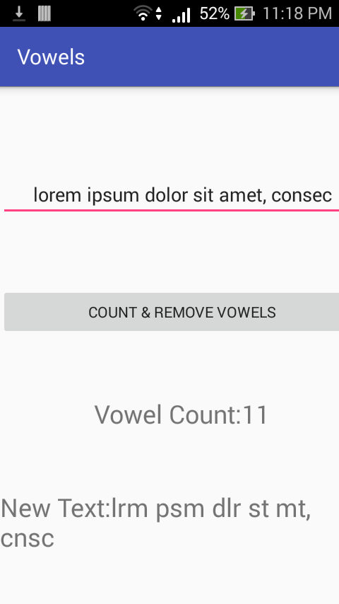

Vowels
==

This is a laboratory activity for 25048 Mobile Computing Lab last 07/22/2017. The objective of the project is as simple as follows:

* Count the number of vowel letters in a given string.
* Remove the vowel letters from a given string.
* Pass the processed string to another activity using intent.
* Display the number of each character in the processed string in the new activity.

Type a string input to be processed.

A Toast object shows up when the string is processed.

The app shows the number of vowel letters in the given user string input, and a version of the user string input without vowels.