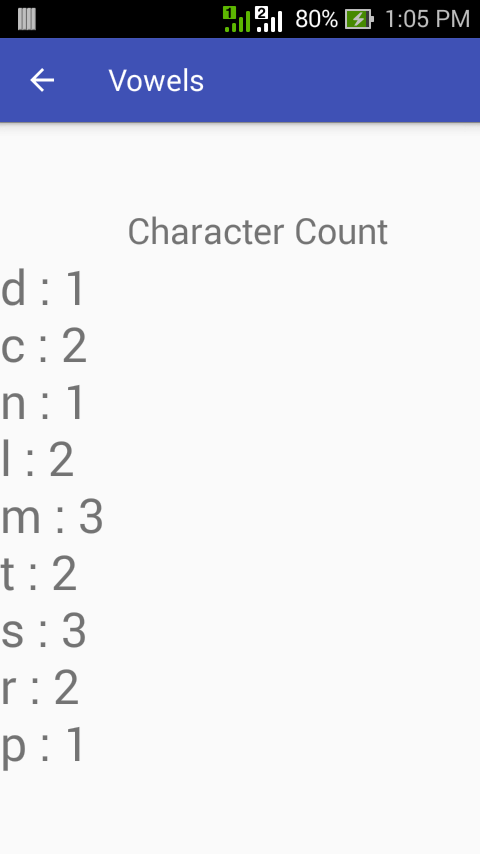

Act4Agarap
==

This is a laboratory activity for 25048 Mobile Computing Lab last 07/22/2017. The objective of the project is as simple as follows:

* Count the number of vowel letters in a given string.
* Remove the vowel letters from a given string.
* Pass the processed string to another activity using intent.
* Display the number of each character in the processed string in the new activity.

Type a string input, then with the "Count & Remove Vowels", the string shall be processed, i.e. the number of vowels shall be counted and the vowels shall be removed.

The processed string shall be passed to a new activity through an intent. Then, the count of each character in the string shall be displayed in the new activity.