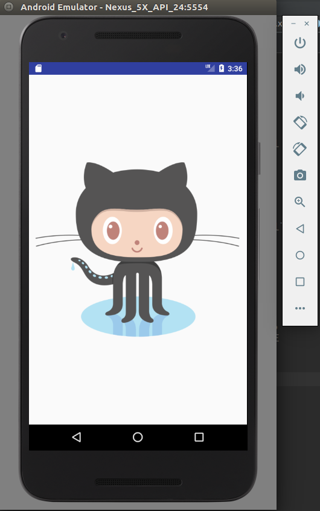
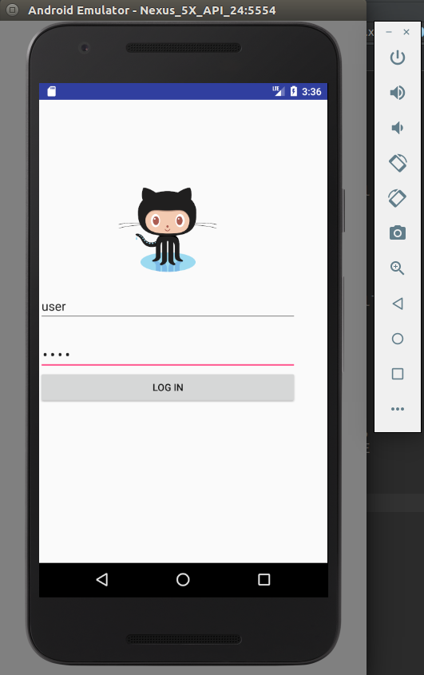
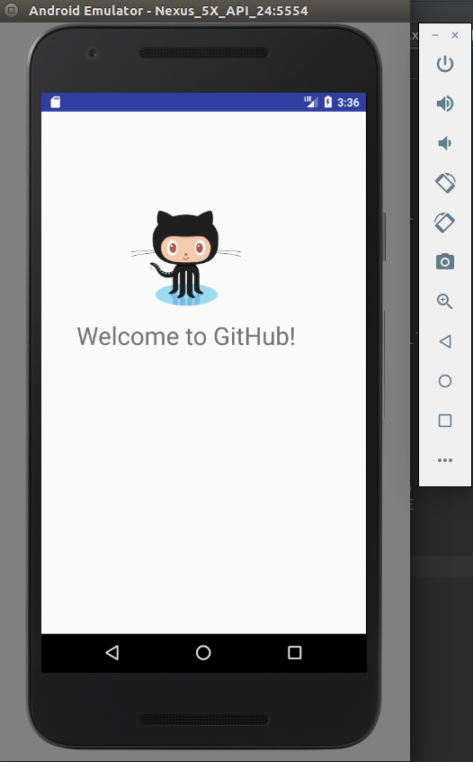
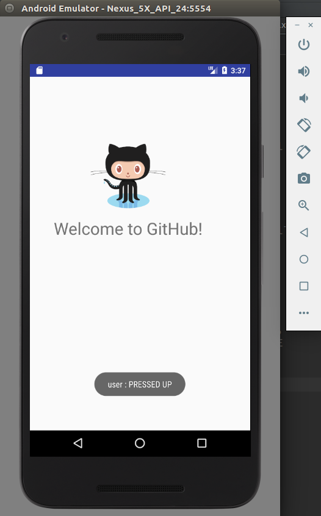

# Splash screen Activity #

This is a laboratory activity done last August 12, 2017 for 25048 Mobile Computing in Adamson University (1st semester, 2017-2018). The objectives of this activity are as follows:

* Create a splash screen, then transition to next activity
* Get rid of going back to splash screen when user presses "back" on his/her Android phone
* Create a third activity that goes back to the second activity when the user presses "back", instead of going to onDestroy() phase of the life cycle.

Splash screen activity (first activity).

Login activity after splash screen (second activity).

Welcome activity after successful login (third activity).

Toast showing "user : PRESSED DOWN" when MotionEvent ACTION_DOWN has been received by ImageView (Octocat).

Toast showing "user : PRESSED UP " when MotionEvent ACTION_UP has been received by ImageView (Octocat).
