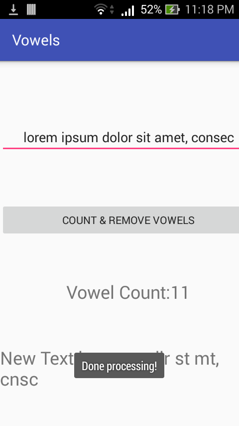

Vowels
==

This is a homework for 25048 Mobile Computing Lab, set for submission on or before 07/15/2017. The objective of the project is as simple as follows:

* Count the number of vowel letters in a given string.
* Remove the vowel letters from a given string.

Type a string input to be processed.

A Toast object shows up when the string is processed.

The app shows the number of vowel letters in the given user string input, and a version of the user string input without vowels.